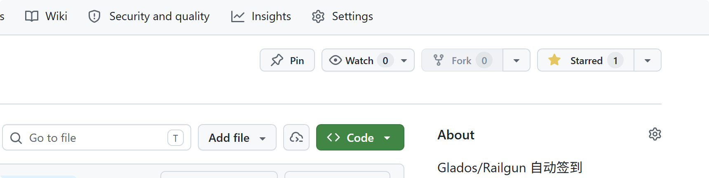
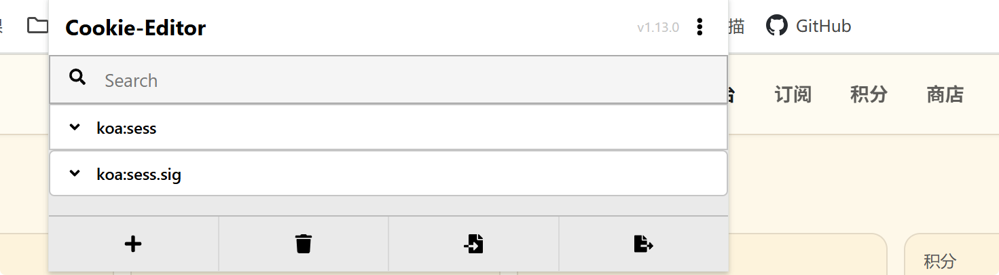
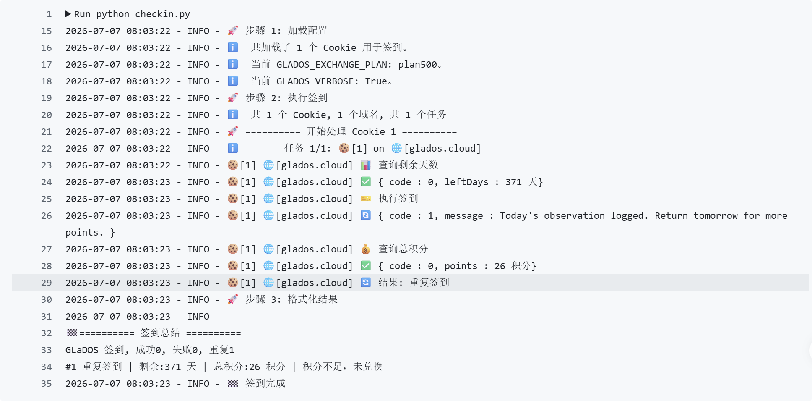

# Glados自动签到

## 食用方式：

### 注册一个GLaDOS的账号([注册地址](https://glados.space/landing/0A58E-NV28S-6U3QV-33VMG))

#### 我的邀请码：([0A58E-NV28S-6U3QV-33VMG](https://0a58e-nv28s-6u3qv-33vmg.glados.space)) 

### Fork 并 Star 本仓库

1. 点击页面右上角的 **Fork**，把本仓库复制到自己的 GitHub 账号下。
2. 进入 Fork 后的仓库，点击 **Star**，避免仓库长期无活动导致 Actions 停用。
3. 后续所有 Secret 和 Actions 配置都在你 Fork 后的仓库中完成。



### 添加 Secret

1. 跳转至自己的仓库的`Settings`->`Secrets and variables`->`Action`

2. 添加1个`repository secret`，命名为`GLADOS_COOKIES`，其值对应 GLaDOS 账号 Cookie 中的 `koa:sess` 和 `koa:sess.sig`。

推荐使用浏览器扩展 **Cookie-Editor** 获取：

- 登录 [GLaDOS](https://glados.cloud) 后，点击浏览器扩展栏里的 **Cookie-Editor**。
- 确认列表中存在 `koa:sess` 和 `koa:sess.sig` 两项。
- 点击 Cookie-Editor 底部的导出按钮，复制导出的 Cookie 文本。
- 将其中的 `koa:sess=...; koa:sess.sig=...;` 配置到 GitHub Secret `GLADOS_COOKIES`。



> 参考格式：`koa:sess=eyJ1c2xxxxxxxxxxxxxxxxxxxxxxxxxxxxxxxxxxxxxxxxxxAwMH0=; koa:sess.sig=xJkOxxxxxxxxxxxxxxxtnM;`

- 多账号请在 `GLADOS_COOKIES` 中添加多个 Cookie，中间使用 `&` 连接。（例如：`cookie1&cookie2&cookie3`）

3. 配置积分兑换策略（非必须）

- 添加1个`repository secret`，命名为`GLADOS_EXCHANGE_PLAN`，配置自动兑换积分策略：

| 值 | 积分要求 | 兑换天数 |
|---|---------|---------|
| `plan100` | 100 积分 | 10 天 |
| `plan200` | 200 积分 | 30 天 |
| `plan500` | 500 积分 | 100 天 (默认) |

> 不配置时默认为 `plan500`，即积分达到 500 时自动兑换 100 天


## 文件结构

```shell
│  checkin.py	# 签到脚本
│
├─.github
│  └─workflows
│          gladosCheck.yml	# Actions 配置文件
```

## 更新日志

- **2026-01**: 重构代码，添加log输出方便定位，支持新版网址，支持配置积分兑换策略。
- **2026-07**: 默认仅使用 `glados.cloud` 签到，移除手机推送配置，优化环境变量与日志输出。


## 问题排查与定位

大家可以通过查询 Actions 中的 `Running checkin` 日志快速定位问题。

正常运行时，日志会显示加载 Cookie、执行签到、查询剩余天数、查询总积分和签到总结：



如果日志中出现 Cookie 无效、未授权或请求失败，请重新使用 Cookie-Editor 获取并更新 `GLADOS_COOKIES`。

## 声明

本项目不保证稳定运行与更新, 因GitHub相关规定可能会删库, 请注意备份


